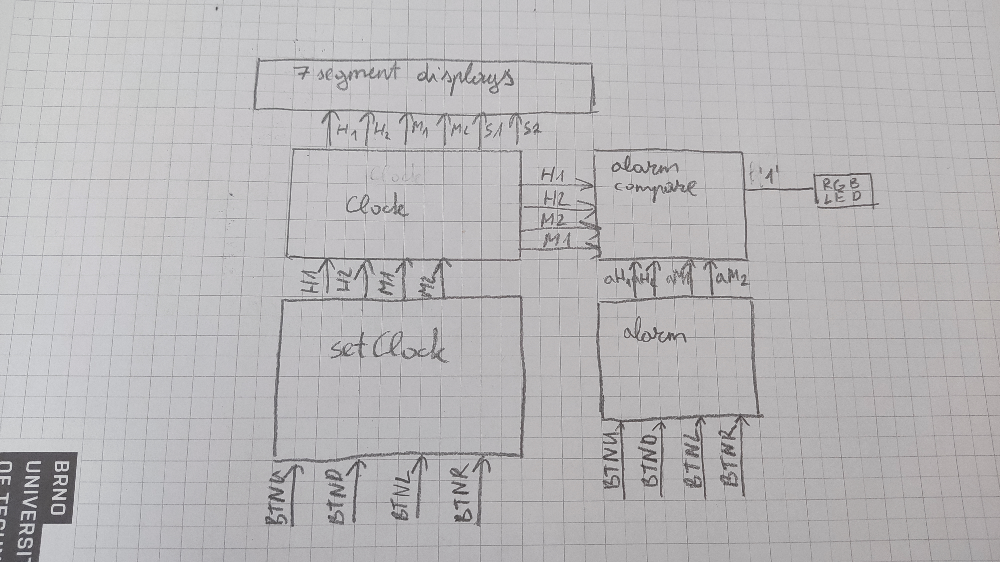

Since, 2 big parts of our project are not working we would like to give an explanation on how this project is supposed to work.

Using buttons BTNU, BTND, BTNL and BTNR we set the digits for the alarm and the time of the clock. Depending on whether the switch is on or of we the buttons work for the alarm or they set the time.

If we are setting the time, the switch is ON. The clock stops ticking and we can start setting the time.
If we are setting an alarm, the switch is OFF. Then instead of the time stopping we have LEDs which indicate what digit we are changing. As soon as the clock time matches the alarm time the RGB LED should turn blue indicating the alarm.

The time set through the setClock module goes straight to the Clock and from there straight to the seven digit displays.

